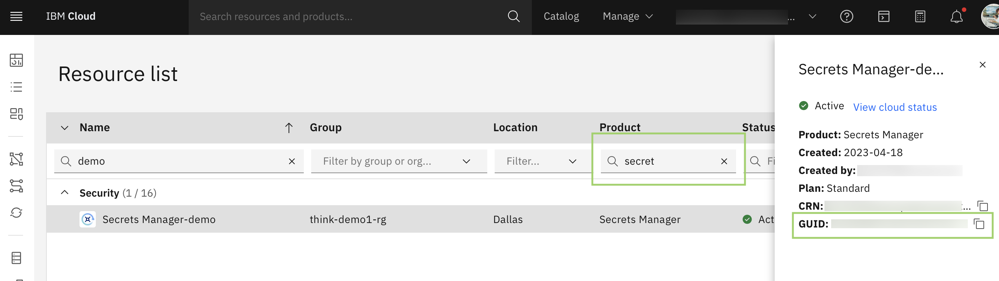

---

copyright:
  years: 2023, 2024
lastupdated: "2024-05-24"

keywords:
subcollection: powervs-vpc
content-type: tutorial
services: vpc, secrets-manager, dl, schematics
account-plan: paid
completion-time: 10 mins

---

{{site.data.keyword.attribute-definition-list}}

# Connect to a VPC landing zone by using a client-to-site VPN

This tutorial dives into the fastest option to get up and running with a [client VPN for VPC](/docs/vpc?topic=vpc-vpn-client-to-site-overview) connectivity.
{: shortdesc}


## Before you begin
{: #solution-connect-client-vpn-prereqs}

- The list of users who will connect over the VPN connection to your {{site.data.keyword.cloud_notm}} account.

    The module takes a list of email addresses of the users in your {{site.data.keyword.cloud_notm}} account. For more information about how to add users, see [Inviting users to an account](/docs/account?topic=account-iamuserinv&interface=ui).

- If you have a {{site.data.keyword.secrets-manager_short}} instance, you need the following information:

    The Terraform module creates a {{site.data.keyword.secrets-manager_short}} instance if you don't already have one.
    {: reminder}

    - Copy the `region` of your {{site.data.keyword.secrets-manager_short}} instance by using the {{site.data.keyword.cloud_notm}} console.
    - Copy the `GUID` of the instance. You can locate the {{site.data.keyword.secrets-manager_short}} GUID in your account from the resource list in the {{site.data.keyword.cloud_notm}} console as shown in the following screenshot.
        1.  Enter `secret` in the product filter. A list of {{site.data.keyword.secrets-manager_short}} instances are displayed.
        1.  Click the row to display the details in the sidebar for the {{site.data.keyword.secrets-manager_short}} instance that you want to use.
        1.  Copy the GUID.

            {: caption="Figure 1. Example view of the resource list in {{site.data.keyword.cloud_notm}} console" caption-side="bottom"}
    - If you used a certificate template to create a private certificate that is applied to your {{site.data.keyword.secrets-manager_short}} instance, copy the name of the certificate template.
        1.  In the resource list, click the name of the {{site.data.keyword.secrets-manager_short}} instance that you selected earlier.
        1.  Click **Secrets engines** > **Private certificates**.
        1.  In the Certificate authority table, expand the certificate authority and copy the name of the template.

## Configure the OpenVPN client
{: #solution-connect-client-vpn-openvpn}
{: step}

After the VPN server cloud resources are deployed, set up the OpenVPN client on devices that will access your landing zone.

1.  Download the OpenVPN profile from the VPN server

    - By using the {{site.data.keyword.cloud_notm}} console:
        1.  Click the **Navigation menu** icon , and then click **VPC Infrastructure** > **VPNs** in the **Network** section to open the VPNs for VPC page.
        1.  Click the **Client-to-site servers** tab and select the client-to-site VPN server that you created.
        1.  Click the **Clients** tab. Then, click **Download client profile**.

      Or

    - By using the {{site.data.keyword.cloud_notm}} CLI:

      ```sh
      ibmcloud is vpn-server-client-configuration VPN_SERVER --file client2site-vpn.ovpn
      ```
      {: pre}

      Look for the `VPN_SERVER` ID in the output of the Terraform apply from the validation step. If you don't find it there, follow the previous steps to download the profile and look in the `<vpn_server>.ovpn` file.
1.  Set up the client:

    You can follow the steps in [Setting up a VPN client](/docs/vpc?topic=vpc-setting-up-vpn-client).
    {: tip}

    1.  Download and install the OpenVPN client application from https://openvpn.net.
    1.  Open the OpenVPN client application, and import the `client2site-vpn.ovpn` file.
    1.  Enter one of the {{site.data.keyword.cloud_notm}} email addresses that was configured to access the VPN as the user ID.
1.  Go to [https://iam.cloud.ibm.com/identity/passcode](https://iam.cloud.ibm.com/identity/passcode) in your browser to generate a passcode. Copy the passcode.
1.  Return to the OpenVPN client application and paste the one-time passcode. Then, import the `client2site-vpn.ovpn` certificate file.

### Using client certificates rather than one-time passcodes
{: #connect-client-vpn-certs}

If you want to configure client certs on the VPN rather than using a one-time-passcode, follow the instructions in the [Managing VPN server and client certifications](/docs/vpc?topic=vpc-client-to-site-authentication#creating-cert-manager-instance-import) section of the client-to-site documentation.

## Test your VPN connection
{: #connect-client-vpn-connection}
{: step}

On the device that has the OpenVPN client, ping the `10.30.10.*` network (which is in your edge VPC).

```bash
ping 10.30.40.1
PING 10.30.40.1 (10.30.40.1): 56 data bytes
64 bytes from 10.30.40.1: icmp_seq=0 ttl=64 time=19.920 ms
64 bytes from 10.30.40.1: icmp_seq=1 ttl=64 time=19.301 ms
64 bytes from 10.30.40.1: icmp_seq=2 ttl=64 time=14.490 ms
64 bytes from 10.30.40.1: icmp_seq=3 ttl=64 time=20.896 ms
64 bytes from 10.30.40.1: icmp_seq=4 ttl=64 time=13.938 ms
^C
--- 10.30.40.1 ping statistics ---
5 packets transmitted, 5 packets received, 0.0% packet loss
round-trip min/avg/max/stddev = 13.938/17.709/20.896/2.904 ms
```

If you see no timeouts or other errors, your local workstation has connectivity to the VPC’s private network.

### Solving connectivity issues
{: #connect-client-vpn-connectivity}

In the following error, OpenVPN has an active connection, but can't reach a server on your private VPN subnet. Check the local network that your device connects through. Some newer routers allocate IP addresses in `10.*` range rather than `192.168.*`.

```text
error: dial tcp: lookup YOUR_SERVER_URL on 10.0.0.1:53:
read udp 10.0.0.2:0->10.0.0.1:53:
i/o timeout- verify you have provided the correct host and port and that the server is currently running.
```
{: screen}