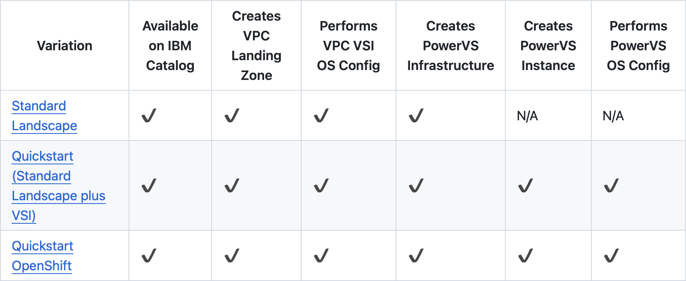

---

copyright:
  years: 2023, 2025
lastupdated: "2025-02-03"
keywords: powervs, landing zone, sap, automation, deployable architecture
subcollection: powervs-vpc

---

{{site.data.keyword.attribute-definition-list}}

# Overview of {{site.data.keyword.powerSys_notm}} with VPC landing zone deployable architectures
{: #automation-solution-overview}

Provisioning {{site.data.keyword.powerSys_notm}} with VPC landing zone by using deployable architectures provides an automated deployment method to create an isolated {{site.data.keyword.powerSys_notm}} workspace and connect it with IBM Cloud services and public internet. Network management components like DNS, NTP, proxy servers and NFS as a Service might be installed. Comparing the provisioning through the projects UI, user interaction is minimized and ready-to-go deployment time of a {{site.data.keyword.powerSys_notm}} workspace is reduced from days to less than 1 hour. 

Automated {{site.data.keyword.powerSys_notm}} with VPC landing zone provisioning that is described in this guide is based on {{site.data.keyword.cloud_notm}} catalog deployable architectures. In this documentation, we describe only specifics that are related to {{site.data.keyword.powerSys_notm}} with VPC landing zone deployable architecture.

In the following sections, the deployable architecture variants are described. 

{: caption="Solution Overview" caption-side="center"}

## 1. Standard variation
{: #overview-standard-variant}

This deployable architecture variation deploys these resources:

| Resource Type | Optional | Description |
|---|---|---|
| Workspace for {{site.data.keyword.powerSys_notm}} |  | [Workspace for {{site.data.keyword.powerSys_notm}}](https://cloud.ibm.com/docs/power-iaas?topic=power-iaas-creating-power-virtual-server#creating-service) with 2 subnets and an SSH key |
| Stock Images  | Yes | Imports IBM Provided Stock Catalog Images into Workspace for {{site.data.keyword.powerSys_notm}} |
| Custom Images | Yes | Imports up to three custom images from Cloud Object Storage into Workspace for {{site.data.keyword.powerSys_notm}} |
{: class="standard-variant-table"}
{: tab-group="standard-variant"}
{: #standard-variant-1}
{: tab-title="{{site.data.keyword.powerSys_notm}}"}
{: caption="Standard Variation Components" caption-side="bottom"}

| Resource Type | Optional | Description |
|---|---|---|
|  VPC |  |  Edge VPC: ACL, SGs, SSH Key and 4 Subnets |
|  Intel VSI |  | Jump box running RHEL 9.4 with floating IP attached |
|  Intel VSI |  | Network Services running RHEL 9.4 configured as squid proxy, NTP and DNS servers(using Ansible Galaxy collection roles [IBM Power Linux for SAP](https://galaxy.ansible.com/ui/repo/published/ibm/power_linux_sap/)). Also configured as central ansible execution node |
| Intel VSI,\nIBM Cloud Monitoring Instance | Yes | Monitoring Host Running SLES 15SP5 to collect metrics and forward it to IBM Monitoring Instance\n [IBM Cloud monitoring Instance](https://cloud.ibm.com/docs/monitoring) displays the platform metrics and OS metrics |
| File storage share,\n Application load balancer | Yes | [NFS as a Service]((https://cloud.ibm.com/docs/vpc?topic=vpc-file-storage-create&interface=ui))\n [Application Load Balancer](https://cloud.ibm.com/docs/vpc?topic=vpc-load-balancers&interface=ui) is deployed along with File storage share to access the share IP from Power Virtual Server |
| Virtual Private Endpoint Gateway|  | A [Virtual Private Endpoint Gateway](https://cloud.ibm.com/docs/vpc?topic=vpc-about-vpe) to reach the Cloud Object Storage bucket |
| Flow Logs for VPC|  | [Flow Logs for VPC](https://cloud.ibm.com/docs/vpc?topic=vpc-flow-logs) enables the collection, storage, and presentation of information about the Internet Protocol (IP) traffic going to and from network interfaces within your VPC|
| Client to Site VPN Server,\nSecrets Manager | Yes | [Client to Site VPN Server](https://cloud.ibm.com/docs/vpc?topic=vpc-vpn-client-to-site-overview) provides client-to-site connectivity, which allows remote devices to securely connect to the VPC network using an OpenVPN software client.\n [Secrets Manager](https://cloud.ibm.com/docs/secrets-manager) Instance is deployed along with VPN to store the VPN Certificate |
{: class="standard-variant-table"}
{: tab-group="standard-variant"}
{: #standard-variant-2}
{: tab-title="VPC"}
{: caption="Standard Variation Components" caption-side="bottom"}

| Resource Type | Optional | Description |
|---|---|---|
| Key Protect |  | [Key Protect](https://cloud.ibm.com/docs/key-protect/index.html) provides key management by integrating the IBM Key Protect for IBM Cloud service. These key management services help you create, manage, and use encryption keys to protect your sensitive data |
| Transit Gateway |  | Global or local [Transit Gateway](https://cloud.ibm.com/docs/transit-gateway) to interconnect VPC and {{site.data.keyword.powerSys_notm}} workspace |
| Cloud Object Storage | |  [Cloud Object Storage](https://cloud.ibm.com/docs/cloud-object-storage) instance, buckets and credentials are created |
{: class="standard-variant-table"}
{: tab-group="standard-variant"}
{: #standard-variant-3}
{: tab-title="Cloud Service"}
{: caption="Standard Variation Components" caption-side="bottom"}

## 2. Standard Extend variation
{: #overview-standard-extend-variant}

This variation has a prerequisite. You must deploy the 'Create a new architecture Standard' variant first.
{: important}

The 'Extend {{site.data.keyword.powerSys_notm}} with VPC landing zone' variation creates an additional {{site.data.keyword.powerSys_notm}} workspace and connects it to the existing {{site.data.keyword.powerSys_notm}} with VPC landing zone. It builds on existing {{site.data.keyword.powerSys_notm}} with VPC landing zone deployed as a variation 'Create a new architecture'.
This is typically used for High Availability scenarios in the same regions.

This deployable architecture variation deploys these resources:

| Resource Type | Optional | Description |
|---|---|---|
| Workspace for {{site.data.keyword.powerSys_notm}} |  | [Workspace for {{site.data.keyword.powerSys_notm}}](https://cloud.ibm.com/docs/power-iaas?topic=power-iaas-creating-power-virtual-server#creating-service) with 2 subnets and an SSH key |
| Stock Images  | Yes | Imports IBM Provided Stock Catalog Images into Workspace for {{site.data.keyword.powerSys_notm}} |
| Custom Images | Yes | Imports up to three custom images from Cloud Object Storage into Workspace for {{site.data.keyword.powerSys_notm}} |
{: class="standard-extend-variant-table"}
{: tab-group="standard-extend-variant"}
{: #standard-extend-variant-1}
{: tab-title="{{site.data.keyword.powerSys_notm}}"}
{: caption="Standard Extend Variation Components" caption-side="bottom"}

## 3. Quickstart variation
{: #overview-quickstart-variant}

This deployable architecture variation deploys these resources:

| Resource Type | Optional | Description |
|---|---|---|
| Workspace for {{site.data.keyword.powerSys_notm}} |  | [Workspace for {{site.data.keyword.powerSys_notm}}](https://cloud.ibm.com/docs/power-iaas?topic=power-iaas-creating-power-virtual-server#creating-service) with 2 subnets and an SSH key |
| {{site.data.keyword.powerSys_notm}} Instance  |  | A {{site.data.keyword.powerSys_notm}} instance of chosen T-shirt size or a custom t-shirt size. Refer to the [table](/docs/powervs-vpc?topic=powervs-vpc-automation-solution-overview#resize_core_memory-1) below. |
{: class="quickstart-variant-table"}
{: tab-group="quickstart-variant"}
{: #quickstart-variant-1}
{: tab-title="{{site.data.keyword.powerSys_notm}}"}
{: caption="Quickstart Variation Components" caption-side="bottom"}

| Resource Type | Optional | Description |
|---|---|---|
|  VPC |  |  Edge VPC: ACL, SGs, SSH Key and 4 Subnets |
|  Intel VSI |  | Jump box running RHEL 9.4 with floating IP attached |
|  Intel VSI |  | Network Services running RHEL 9.4 configured as squid proxy, NTP and DNS servers(using Ansible Galaxy collection roles [IBM Power Linux for SAP](https://galaxy.ansible.com/ui/repo/published/ibm/power_linux_sap/)). Also configured as central ansible execution node |
| Intel VSI,\nIBM Cloud Monitoring Instance | Yes | Monitoring Host Running SLES 15SP5 to collect metrics and forward it to IBM Monitoring Instance\n [IBM Cloud monitoring Instance](https://cloud.ibm.com/docs/monitoring) displays the platform metrics and OS metrics |
| File storage share,\n Application load balancer | Yes | [NFS as a Service]((https://cloud.ibm.com/docs/vpc?topic=vpc-file-storage-create&interface=ui))\n [Application Load Balancer](https://cloud.ibm.com/docs/vpc?topic=vpc-load-balancers&interface=ui) is deployed along with File storage share to access the share IP from Power Virtual Server |
| Virtual Private Endpoint Gateway|  | A [Virtual Private Endpoint Gateway](https://cloud.ibm.com/docs/vpc?topic=vpc-about-vpe) to reach the Cloud Object Storage bucket |
| Flow Logs for VPC|  | [Flow Logs for VPC](https://cloud.ibm.com/docs/vpc?topic=vpc-flow-logs) enables the collection, storage, and presentation of information about the Internet Protocol (IP) traffic going to and from network interfaces within your VPC|
| Client to Site VPN Server,\nSecrets Manager | Yes | [Client to Site VPN Server](https://cloud.ibm.com/docs/vpc?topic=vpc-vpn-client-to-site-overview) provides client-to-site connectivity, which allows remote devices to securely connect to the VPC network using an OpenVPN software client.\n [Secrets Manager](https://cloud.ibm.com/docs/secrets-manager) Instance is deployed along with VPN to store the VPN Certificate |
{: class="quickstart-variant-table"}
{: tab-group="quickstart-variant"}
{: #quickstart-variant-2}
{: tab-title="VPC"}
{: caption="Quickstart Variation Components" caption-side="bottom"}

| Resource Type | Optional | Description |
|---|---|---|
| Key Protect |  | [Key Protect](https://cloud.ibm.com/docs/key-protect/index.html) provides key management by integrating the IBM Key Protect for IBM Cloud service. These key management services help you create, manage, and use encryption keys to protect your sensitive data |
| Transit Gateway |  | Global or local [Transit Gateway](https://cloud.ibm.com/docs/transit-gateway) to interconnect VPC and {{site.data.keyword.powerSys_notm}} workspace |
| Cloud Object Storage | |  [Cloud Object Storage](https://cloud.ibm.com/docs/cloud-object-storage) instance, buckets and credentials are created |
{: class="quickstart-variant-table"}
{: tab-group="quickstart-variant"}
{: #quickstart-variant-3}
{: tab-title="Cloud Service"}
{: caption="Quickstart Variation Components" caption-side="bottom"}

You can run AIX, IBM i, and Linux images on your virtual server instances. Select the required T-shirt size and a virtual server instance with chosen T-shirt size or custom configuration is deployed. The T-shirt sizes and the configuration parameters mapping are shown in the following table:

|  | XS | S | M | L |
|---------------------- | ------------------------- | ------------------------- | -------------------------  | ------------------------- |
| Cores | 1 | 4 | 8 | 15 |
| Memory | 32 | 128 | 256 | 512 |
| Storage Tier-3 (GB) | 100 | 500 | 1000 | 2000 |
{: class="simple-tab-table"}
{: tab-group="t-shirt size"}
{: caption="T-shirt size and configuration mapping" caption-side="top"}
{: #resize_core_memory-1}
{: tab-title="AIX"}

|  | XS | S | M | L |
|---------------------- | ------------------------- | ------------------------- | -------------------------  | ------------------------- |
| Cores | 0.25 | 1 | 2 | 4 |
| Memory | 8 | 32 | 64 | 132 |
| Storage Tier-3 (GB) | 100 | 500 | 1000 | 2000 |
{: class="simple-tab-table"}
{: tab-group="t-shirt size"}
{: caption="T-shirt size and configuration mapping" caption-side="top"}
{: #resize_core_memory-2}
{: tab-title="IBM i"}

|  | US1 \n Test/Dev |
|---------------------- | ------------------------- |
| Cores | 4 |
| Memory | 128 |
| Storage Tier-3 (GB) | 750 |
{: class="simple-tab-table"}
{: tab-group="t-shirt size"}
{: caption="T-shirt size and configuration mapping" caption-side="top"}
{: #resize_core_memory-3}
{: tab-title="SAP HANA (RHEL/SLES)"}

## 4. Import variation
{: #overview-powervs-workspace-import-variant}

Create an IBM Cloud schematics workspace for your pre-existing VPC and {{site.data.keyword.powerSys_notm}} infrastructure resources using the new {{site.data.keyword.powerSys_notm}} (PowerVS) with VPC landing zone variation - 'Import {{site.data.keyword.powerSys_notm}} Workspace'. 

This variation helps to install the deployable architecture ['Power Virtual Server for SAP HANA'](https://cloud.ibm.com/catalog/architecture/deploy-arch-ibm-pvs-sap-9aa6135e-75d5-467e-9f4a-ac2a21c069b8-global) on top of a pre-existing {{site.data.keyword.powerSys_notm}}(PowerVS) landscape. 'Power Virtual Server for SAP HANA' automation requires a schematics workspace id for installation. The 'Import' solution creates a schematics workspace by taking pre-existing VPC and {{site.data.keyword.powerSys_notm}} infrastructure resource details as inputs. The ID of this schematics workspace will be the pre-requisite workspace id required by 'Power Virtual Server for SAP HANA' to create and configure the {{site.data.keyword.powerSys_notm}} instances for SAP on top of the existing infrastructure. 

Check the pre-requisites for this variation [here](https://github.com/terraform-ibm-modules/terraform-ibm-powervs-infrastructure/tree/main/solutions/import#pre-requisites).

## Other {{site.data.keyword.powerSys_notm}} related deployable architectures
{: #overview-automation-solution-components}

In addition to the {{site.data.keyword.powerSys_notm}} with VPC landing zone other deployable architectures and terraform based solutions might be deployed. 

- [{{site.data.keyword.powerSys_notm}} for SAP HANA deployable architecture](/docs/sap-powervs)
- [FalconStor StorSafe VTL for {{site.data.keyword.powerSys_notm}} Cloud](https://falconstor-download.s3.us-east.cloud-object-storage.appdomain.cloud/FalconStor%20VTL%20for%20IBM%20Deployment%20Guide.pdf){: external}
