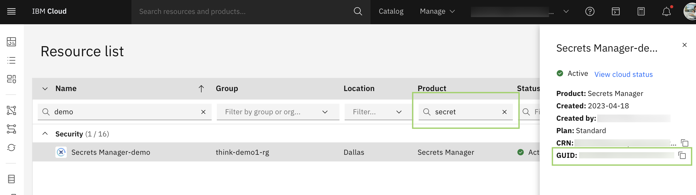

---

copyright:
  years: 2023, 2024
lastupdated: "2024-10-31"
keywords: iam, permissions
subcollection: powervs-vpc
content-type: tutorial
services: iam, apikey, vpn, sshkeys
completion-time: 1h

---

{{site.data.keyword.attribute-definition-list}}

# Before you begin deploying
{: #powervs-automation-prereqs}
{: toc-content-type="tutorial"}
{: toc-services="iam, apikey, vpn, sshkeys"}
{: toc-completion-time="1h"}

This tutorial walks through necessary steps required to be preformed which enables a user to successfully deploy the architecture.

## IAM Permissions
{: #iam-permissions}
{: step}

IAM access roles are required to install this deployable architecture and create all the required elements.

You need the following permissions for this deployable architecture:

1. Create services from {{site.data.keyword.cloud_notm}} catalog.
1. Create and modify {{site.data.keyword.vpc_short}} services, virtual server instances, networks, network prefixes, storage volumes, SSH keys, and security groups of this VPC.
1. Create and modify {{site.data.keyword.powerSysShort}} services, virtual server instances, networks, storage volumes, ssh keys of this {{site.data.keyword.powerSysShort}}.
1. Create and modify {{site.data.keyword.cloud_notm}} direct links and {{site.data.keyword.tg_full_notm}}.
1. Access existing {{site.data.keyword.cos_short}} services.
1. The Editor role on the Projects service.
1. The Editor and Manager role on the Schematics service.
1. The Viewer role on the resource group for the project.

For information about configuring permissions, contact your {{site.data.keyword.cloud_notm}} account administrator.

## Generate API key
{: #generate-api-key}
{: step}

The API key is **mandatory** for the deployment. The API keys can be deleted independently if compromised without interfering with other API keys or even the user. You can create up to 20 API keys.

To create an API key for your user identity in the UI, complete the following steps:
1. In the IBM Cloud console, go to **Manage > Access (IAM) > API keys**.
1. Click Create an **IBM Cloud API key**.
1. Enter a name and description for your API key.
1. Click **Create**.
1. Then, click Show to display the API key. Or, click Copy to copy and save it for later, or click Download.


## Generate a SSH key Pair
{: #powervs-automation-ssh-key}
{: step}

This key is used to log in to all virtual server instances that you create.

**This step can be skipped** if user has already a pair of ssh keys which meet the following requirements:
1. Key is of **RSA** format
1. **No passphrase** (must not be password encrypted)
1. SSH public key is **currently unused** in the target deployment region. 

**Paste the content of `id_rsa.pub` key and `id_rsa` key directly in the field for input variables `ssh_public_key` and `ssh_private_key`respectively.**

If **you do not have existing keys**, steps to generate keys is defined below.

SSH Key can be generated by using any method. When generating a key pair, make sure that:
1. **passphrase is empty(must not be password encrypted)** 
1. Key format is `RSA`.

### Linux OS
{: #ssh-key-linux}

On the command line type, the command `ssh-keygen`. It places the id_rsa and id_rsa.pub files under `/root/.ssh/id_rsa`.

```sh
ssh-keygen -t rsa
Generating public/private rsa key pair.
Enter file in which to save the key (/root/.ssh/id_rsa):
Enter passphrase (empty for no passphrase):
Enter same passphrase again:
Your identification has been saved in /root/.ssh/id_rsa
Your public key has been saved in /root/.ssh/id_rsa.pub
The key fingerprint is:
SHA256:TUdZn9O6tnwK2lc4m917Cs1KvbyXs2n46yrlE2I1t/I root@ans-jump-box-001
The key's randomart image is:
+---[RSA 3072]----+
|            .o.  |
|           ..  .o|
|          . .  oo|
|         o . o o.|
|        S . . +..|
|           o Boo.|
|          . B @*o|
|           = @+EB|
|          . +o#&*|
+----[SHA256]-----+
```

### Windows OS
{: #ssh-key-windows}

You can install [MobaXterm](https://mobaxterm.mobatek.net/download.html){: external} application and start a local terminal.
On the command line type, the command `ssh-keygen`. It places the id_rsa and id_rsa.pub files under `/home/mobaxterm/.ssh/`

```sh
ssh-keygen -t rsa
Generating public/private rsa key pair.
Enter file in which to save the key (/home/mobaxterm/.ssh/id_rsa):
Enter passphrase (empty for no passphrase):
Enter same passphrase again:
Your identification has been saved in /home/mobaxterm/.ssh/id_rsa
Your public key has been saved in /home/mobaxterm/.ssh/id_rsa.pub
The key fingerprint is:
SHA256:TUdZn9O6tnwK2lc4m917Cs1KvbyXs2n46yrlE2I1t/I
The key's randomart image is:
+---[RSA 3072]----+
|            .o.  |
|           ..  .o|
|          . .  oo|
|         o . o o.|
|        S . . +..|
|           o Boo.|
|          . B @*o|
|           = @+EB|
|          . +o#&*|
+----[SHA256]-----+
```

**These public and private key values** can now be used in the input variables for the Deployable architectures.

**Paste the content of `id_rsa.pub` key and `id_rsa` key directly in the field for input variables `ssh_public_key` and `ssh_private_key`respectively.**


## Reusing existing Secrets Manager Instance (Optional)
{: #powervs-automation-vpn-prereqs}
{: step}

The Deployable architecture supports creation of Client to Site VPN server optionally. If enabled, the prerequisite for creating a Client to Site VPN server is a Server Certificate which can be only read from a {{site.data.keyword.secrets-manager_short}} instance.

The automation provides flexibility in :
Automatically generating a new VPN server Certificate, creating a new {{site.data.keyword.secrets-manager_short}} instance and storing the certificate.

**OR** 

Allowing the user to pass the details of existing {{site.data.keyword.secrets-manager_short}} instance and the certificate details in the optional parameters field which would override the default configuration of creating a new {{site.data.keyword.secrets-manager_short}} instance.

- To **reuse** the {{site.data.keyword.secrets-manager_short}} instance if you have one, you need the following information:

    The Terraform module creates a {{site.data.keyword.secrets-manager_short}} instance if you don't already have one.
    {: reminder}

    - Copy the `region` of your {{site.data.keyword.secrets-manager_short}} instance by using the {{site.data.keyword.cloud_notm}} console.
    - Copy the `GUID` of the instance. You can locate the {{site.data.keyword.secrets-manager_short}} GUID in your account from the resource list in the {{site.data.keyword.cloud_notm}} console as shown in the following screenshot.
        1.  Enter `secret` in the product filter. A list of {{site.data.keyword.secrets-manager_short}} instances are displayed.
        1.  Click the row to display the details in the sidebar for the {{site.data.keyword.secrets-manager_short}} instance that you want to use.
        1.  Copy the GUID.

            {: caption="Example view of the resource list in {{site.data.keyword.cloud_notm}} console" caption-side="bottom"}
    - If you used a certificate template to create a private certificate that is applied to your {{site.data.keyword.secrets-manager_short}} instance, copy the name of the certificate template.
        1.  In the resource list, click the name of the {{site.data.keyword.secrets-manager_short}} instance that you selected earlier.
        1.  Click **Secrets engines** > **Private certificates**.
        1.  In the Certificate authority table, expand the certificate authority and copy the name of the template.

## Additional background information
{: #power-automation-prereqs-additional}

- [{{site.data.keyword.powerSys_notm}} service documentation](https://cloud.ibm.com/docs/power-iaas)
- [Deployable architecture code](https://github.com/terraform-ibm-modules/terraform-ibm-powervs-infrastructure){: external}
- Main dependencies:
   - [Terraform IBM Module - VPC Landing Zone](https://github.com/terraform-ibm-modules/terraform-ibm-landing-zone){: external}
   - [Terraform IBM Module - {{site.data.keyword.powerSys_notm}} Workspace](https://github.com/terraform-ibm-modules/terraform-ibm-powervs-workspace){: external}
   - [Terraform IBM Module - {{site.data.keyword.powerSys_notm}} Instance](https://github.com/terraform-ibm-modules/terraform-ibm-powervs-instance){: external}
   - [Terraform IBM Module - Client to site VPN](https://github.com/terraform-ibm-modules/terraform-ibm-client-to-site-vpn){: external}
   - [Terraform IBM Module - Secret Manager](https://github.com/terraform-ibm-modules/terraform-ibm-secrets-manager){: external}
   - [Terraform IBM Module - Secrets Manager Group](https://github.com/terraform-ibm-modules/terraform-ibm-secrets-manager-secret-group){: external}
   - [Terraform IBM Module - Private Secret Engine](https://github.com/terraform-ibm-modules/terraform-ibm-secrets-manager-private-cert-engine){: external}
   - [Terraform IBM Module - Secrets Manager Private Certificate](https://github.com/terraform-ibm-modules/terraform-ibm-secrets-manager-private-cert){: external}
   - [IBM Power Linux SAP ansible galaxy role](https://galaxy.ansible.com/ibm/power_linux_sap){: external}
   
