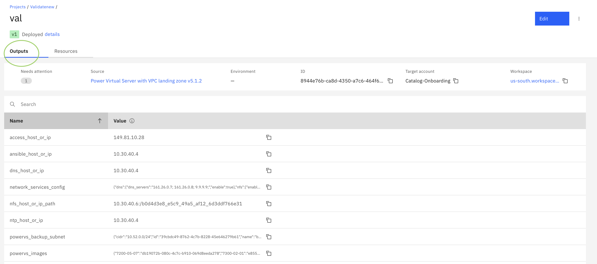

---

copyright:
  years: 2023, 2024
lastupdated: "2024-10-09"

keywords:
subcollection: powervs-vpc
content-type: tutorial
services: powervs, vpc, squid, ansible, dns, nfs
account-plan: paid
completion-time: 1h

---

{{site.data.keyword.attribute-definition-list}}

# Quickstart next steps
{: #solution-quickstart-next-steps}
{: toc-content-type="tutorial"}
{: toc-services="powervs, vpc, squid, ansible, dns, nfs"}
{: toc-completion-time="15m"}

This tutorial explores the fastest way to configure a PowerVS instance after deploying the Quickstart variation.
{: shortdesc}


## Configure the Proxy to reach the internet
{: #solution-quickstart-proxy}
{: step}


1.  Run the following commands in a terminal on the **PowerVS Aix/Linux instance**. Fetch the value `proxy_host_or_ip_port` from the outputs of the deployment in the project configuration screen.

{: caption="Output from Projects" caption-side="bottom"}

```sh
export http_proxy=http://<proxy_host_or_ip_port>:3128
export https_proxy=http://<proxy_host_or_ip_port>:3128
export HTTP_PROXY=http://<proxy_host_or_ip_port>:3128
export HTTPS_PROXY=http://<proxy_host_or_ip_port>:3128
export no_proxy=161.0.0.0/0,10.0.0.0/8
```

To test the connection execute curl command and you must obtain the output as below:
    
```sh
curl google.com

output:
<HTML><HEAD><meta http-equiv="content-type" content="text/html;charset=utf-8">
<TITLE>301 Moved</TITLE></HEAD><BODY>
<H1>301 Moved</H1>
The document has moved
<A HREF="http://www.google.com/">here</A>.
</BODY></HTML>
```

## Mount file storage share from VPC on a PowerVS instance
{: #solution-quickstart-nfs-mount}
{: step}

The file storage share that is created in the VPC can be mounted on the PowerVS instance to share files between landscape.

1.  Run the following commands in a terminal on the **PowerVS Aix/Linux instance**. Fetch the value `nfs_host_or_ip_path` from the outputs of the deployment in the project configuration screen.

**For Linux (RHEL/SLES) Instance:**
```sh
mkdir /nfs
mount <nfs_host_or_ip_path> /nfs
```

**For AIX Instance:**
```sh
# Configure the nfsv4 domain in nfsv4 AIX client
chnfsdom test.com
# Start the nfs services
startsrc -g nfs
# add the nfs ip into /etc/hosts file replace x with the fourth value from the <nfs_host_or_ip_path>
echo "10.30.40.x nfs_server" >> /etc/hosts
# create a directory
mkdir /nfs
# Mount using version 4.
mount -o vers=4 <nfs_host_or_ip_path> /nfs
```

## Configure DNS on PowerVS instance
{: #solution-quickstart-dns}
{: step}

The DNS server is running as a service on network-services intel vsi. Configure the PowerVS instance to use this DNS service.

1.  Run the following commands in a terminal on the **PowerVS Aix/Linux instance**. Fetch the value `dns_host_or_ip_path` from the outputs of the deployment in the project configuration screen. 

Add the `dns_host_or_ip_path` value at the **top** in the `/etc/resolv.conf` file.
